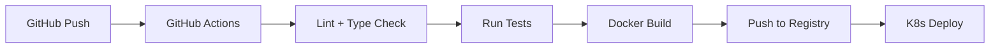
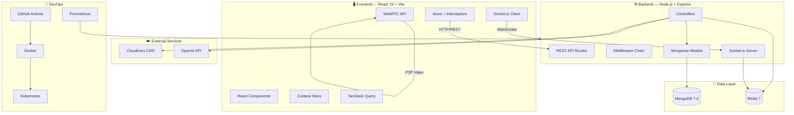

# IntellMeet — Tech Stack Figures & Architecture Diagrams

> Complete visual documentation of every technology used across **Frontend, Backend, API, Database, Real-Time, Security, AI, and DevOps** layers — with the exact prompts used to generate each figure.

---

## 1. Full-Stack Architecture Overview


<details>
<summary>🎨 Prompt used to generate this figure</summary>

```
A clean, modern tech architecture diagram on a dark navy (#0f172a) background showing the full-stack architecture of a web application called "IntellMeet". Layout: Left side shows FRONTEND (React 19 logo, Vite logo, TypeScript logo, Tailwind CSS logo, Zustand state management, TanStack Query) in a rounded glass card. Center shows BACKEND (Node.js logo, Express.js logo, TypeScript logo, Socket.io logo) in another glass card. Right side shows DATA LAYER with MongoDB logo and Redis logo in glass cards. Bottom shows AI LAYER with OpenAI Whisper and GPT-4o logos. Arrows connect the layers: HTTP/REST API arrows from frontend to backend, WebSocket arrows bidirectional, MongoDB connection from backend to database, Redis pub/sub connection. WebRTC P2P arrow from frontend. Use neon purple (#8b5cf6) and cyan (#06b6d4) accent colors for arrows and borders. Professional, clean infographic style. No text wrapping, crisp icons and labels.
```

</details>

### Technologies at a Glance

| Layer | Technologies | Connection Type |
|-------|-------------|----------------|
| **Frontend** | React 19, Vite, TypeScript, Tailwind CSS v4, Zustand, TanStack Query | — |
| **Backend** | Node.js v20+, Express.js, TypeScript, Socket.io | — |
| **Database** | MongoDB 7.0 (Mongoose ODM) | TCP `:27017` |
| **Cache** | Redis 7 (ioredis) | TCP `:6379` |
| **Real-Time** | Socket.io + Redis Adapter | WebSocket |
| **Video** | WebRTC (native browser API) | P2P / STUN/TURN |
| **AI** | OpenAI Whisper + GPT-4o | HTTPS API |
| **Media** | Cloudinary | HTTPS API |
| **DevOps** | Docker, Kubernetes, GitHub Actions, Prometheus | — |

---

## 2. Frontend Technologies


<details>
<summary>🎨 Prompt used to generate this figure</summary>

```
A clean, modern infographic diagram on dark navy (#0f172a) background showing FRONTEND TECH STACK for a React application. Show each technology as a sleek card with its official logo and name: React 19 (blue), Vite (yellow/purple), TypeScript (blue), Tailwind CSS v4 (cyan), Zustand (bear icon), TanStack Query (coral), React Router v6, Axios, Socket.io Client, Radix UI, Lucide Icons, GSAP (green), Motion (Framer Motion), React Hook Form + Zod, date-fns. Arrange in a beautiful grid layout. Each card has a subtle glass morphism effect with purple (#8b5cf6) glow. Title "Frontend Technologies" at the top in white bold modern font. Professional infographic style, no clutter.
```

</details>

### Detailed Breakdown

| Technology | Version | Purpose | File Reference |
|-----------|---------|---------|---------------|
| **React** | `19.0.0` | UI component library | [App.tsx](file:///c:/Users/absol/Documents/AI-Powered%20Enterprise%20Meeting%20%26%20Collaboration_Platform_Zidio_March2026/client/src/App.tsx) |
| **Vite** | `5.3.1` | Build tool & dev server | [vite.config.ts](file:///c:/Users/absol/Documents/AI-Powered%20Enterprise%20Meeting%20%26%20Collaboration_Platform_Zidio_March2026/client/vite.config.ts) |
| **TypeScript** | `5.4.5` | Static type safety | [tsconfig.json](file:///c:/Users/absol/Documents/AI-Powered%20Enterprise%20Meeting%20%26%20Collaboration_Platform_Zidio_March2026/client/tsconfig.json) |
| **Tailwind CSS** | `4.0.0` | Utility-first CSS framework | [index.css](file:///c:/Users/absol/Documents/AI-Powered%20Enterprise%20Meeting%20%26%20Collaboration_Platform_Zidio_March2026/client/src/index.css) |
| **Zustand** | `4.5.4` | Lightweight state management | [auth.store.ts](file:///c:/Users/absol/Documents/AI-Powered%20Enterprise%20Meeting%20%26%20Collaboration_Platform_Zidio_March2026/client/src/store/auth.store.ts) |
| **TanStack Query** | `5.45.0` | Server state & data fetching | [main.tsx](file:///c:/Users/absol/Documents/AI-Powered%20Enterprise%20Meeting%20%26%20Collaboration_Platform_Zidio_March2026/client/src/main.tsx) |
| **React Router** | `6.24.0` | Client-side routing | [App.tsx](file:///c:/Users/absol/Documents/AI-Powered%20Enterprise%20Meeting%20%26%20Collaboration_Platform_Zidio_March2026/client/src/App.tsx) |
| **Axios** | `1.7.2` | HTTP client with interceptors | [axios.ts](file:///c:/Users/absol/Documents/AI-Powered%20Enterprise%20Meeting%20%26%20Collaboration_Platform_Zidio_March2026/client/src/lib/axios.ts) |
| **Socket.io Client** | `4.8.3` | Real-time WebSocket client | [socket.ts](file:///c:/Users/absol/Documents/AI-Powered%20Enterprise%20Meeting%20%26%20Collaboration_Platform_Zidio_March2026/client/src/lib/socket.ts) |
| **Radix UI** | Latest | Accessible headless components | Avatar, Dialog, Dropdown, Select, Tabs, Tooltip, Separator, Slot |
| **Lucide React** | `0.400.0` | Icon library | Used across all components |
| **GSAP** | `3.15.0` | High-performance animations | Scroll-triggered animations |
| **Motion** | `13.4.6` | Declarative React animations | Page transitions, component animations |
| **Lenis** | `1.3.26` | Smooth scroll library | Landing page smooth scrolling |
| **React Hook Form** | `7.78.0` | Form state management | Login, Signup, Profile forms |
| **Zod** | `4.4.3` | Schema validation | Form validation schemas |
| **date-fns** | `4.4.0` | Date utility library | Meeting time formatting |
| **@dnd-kit** | `6.3.1` | Drag-and-drop toolkit | [KanbanBoard.tsx](file:///c:/Users/absol/Documents/AI-Powered%20Enterprise%20Meeting%20%26%20Collaboration_Platform_Zidio_March2026/client/src/pages/workspace/KanbanBoard.tsx) |

---

## 3. Backend Technologies


<details>
<summary>🎨 Prompt used to generate this figure</summary>

```
A clean, modern infographic diagram on dark navy (#0f172a) background showing BACKEND TECH STACK for a Node.js server. Show each technology as a sleek card with its official logo and name: Node.js v20+ (green), Express.js (white), TypeScript (blue), Socket.io (black/white), Mongoose ODM, JWT (JSON Web Tokens), bcrypt.js, Helmet.js (security), Morgan (logging), Winston (logging), Multer (file uploads), Cloudinary (media), express-rate-limit, express-validator, cookie-parser, ioredis, UUID, CORS. Arrange in a beautiful grid layout. Each card has a subtle glass morphism effect with emerald green (#10b981) glow. Title "Backend Technologies" at the top in white bold modern font. Professional infographic style.
```

</details>

### Detailed Breakdown

| Technology | Version | Category | Purpose |
|-----------|---------|----------|---------|
| **Node.js** | `v20+` | Runtime | JavaScript server runtime |
| **Express.js** | `4.19.2` | Framework | REST API framework |
| **TypeScript** | `5.4.5` | Language | Static type safety |
| **Socket.io** | `4.7.5` | Real-Time | WebSocket server for events |
| **Mongoose** | `8.4.1` | ODM | MongoDB object data modeling |
| **@prisma/client** | `5.22.0` | ORM | Database client (schema-first) |
| **jsonwebtoken** | `9.0.2` | Auth | JWT token sign/verify |
| **bcryptjs** | `2.4.3` | Security | Password hashing |
| **helmet** | `7.1.0` | Security | HTTP security headers |
| **cors** | `2.8.5` | Security | Cross-origin resource sharing |
| **morgan** | `1.10.0` | Logging | HTTP request logger |
| **winston** | `3.13.0` | Logging | Application logger |
| **multer** | `1.4.5` | Upload | Multipart file handling |
| **cloudinary** | `2.9.0` | Media | Cloud image/video CDN |
| **ioredis** | `5.4.1` | Cache | Redis client |
| **@socket.io/redis-adapter** | `8.3.0` | Scaling | Socket.io horizontal scaling |
| **express-rate-limit** | `7.3.1` | Security | API rate limiting |
| **express-validator** | `7.1.0` | Validation | Request input validation |
| **cookie-parser** | `1.4.6` | Auth | Cookie parsing middleware |
| **dotenv** | `16.4.5` | Config | Environment variable loading |
| **uuid** | `10.0.0` | Utility | Unique ID generation |
| **better-auth** | `1.7.6` | Auth | Authentication framework |

### Server File Structure

```
server/src/
├── config/          → db.ts, env.ts, redis.ts, cloudinary.ts, socket.ts
├── controllers/     → auth, user, meeting, chat, notification, ai, workspace
├── middleware/       → auth, error, rateLimit
├── models/          → User, Meeting, Message, Notification, Workspace, Project, Task
├── routes/          → auth, user, meeting, chat, notification, ai, workspace
├── sockets/         → meeting.socket, chat.socket, notification.socket
├── utils/           → jwt.ts, cache.ts, logger.ts, upload.ts
└── index.ts         → Express app entry point
```

---

## 4. Data & Real-Time Layer


<details>
<summary>🎨 Prompt used to generate this figure</summary>

```
A clean, modern infographic diagram on dark navy (#0f172a) background showing DATABASE, CACHING, and REAL-TIME COMMUNICATION layer for a web application. Three sections: SECTION 1 "Database" - MongoDB 7.0 logo with Mongoose ODM, showing collections (Users, Meetings, Messages, Notifications, Workspaces, Projects, Tasks). SECTION 2 "Caching & Pub/Sub" - Redis 7 logo with ioredis client, showing cache patterns and pub/sub for horizontal scaling. SECTION 3 "Real-Time" - Socket.io logo showing namespaces: Meeting Signaling (WebRTC offer/answer/ICE), Chat (real-time messaging, typing indicators), Notifications (push notifications). Also show WebRTC P2P video connection. Each section in a glassmorphic card. Use amber (#f59e0b) and red (#ef4444) accent glow. Title "Data & Real-Time Layer" at top. Professional infographic style.
```

</details>

### Database — MongoDB 7.0

| Collection | Purpose | Key Fields |
|-----------|---------|------------|
| `users` | User accounts & profiles | email, password, name, avatar, role |
| `meetings` | Meeting rooms & metadata | title, host, participants, status, roomCode |
| `messages` | Chat messages | meeting, sender, content, timestamp |
| `notifications` | Push notifications | user, type, message, read, link |
| `workspaces` | Team workspaces | name, owner, members, description |
| `projects` | Kanban projects | workspace, name, columns, tasks |
| `tasks` | Individual tasks | project, title, assignee, status, priority |

### Caching — Redis 7

| Pattern | Key Format | TTL | Purpose |
|---------|-----------|-----|---------|
| User Profile | `user:{id}` | 1 hour | Avoid repeated DB lookups |
| Meeting Data | `meeting:{id}` | 30 min | Cache active meeting info |
| Session | `session:{token}` | 7 days | Refresh token storage |

### Real-Time — Socket.io Namespaces

| Namespace | Events | Purpose |
|-----------|--------|---------|
| `/meeting` | `offer`, `answer`, `ice-candidate`, `join-room`, `leave-room` | WebRTC signaling |
| `/chat` | `send-message`, `typing`, `stop-typing`, `read-receipt` | In-meeting chat |
| `/notification` | `new-notification`, `mark-read`, `mark-all-read` | Push notifications |

---

## 5. API Connections & Data Flow


<details>
<summary>🎨 Prompt used to generate this figure</summary>

```
A clean, modern infographic diagram on dark navy (#0f172a) background showing API CONNECTIONS and DATA FLOW for a web application. Show the complete request lifecycle: Browser Client (React) sends HTTP request via Axios → Express Server receives → Middleware chain (CORS → Helmet → Morgan → Rate Limiter → JWT Auth → Validation) → Controller → Model (Mongoose) → MongoDB. Also show: Response flow back with JSON data. Parallel flow: Socket.io WebSocket connection for real-time events (chat, notifications, WebRTC signaling). Show Redis cache layer intercepting database reads. Show Cloudinary connection for media uploads. Show OpenAI API connection for AI features (transcription, summarization). Use gradient arrows in pink (#ec4899) to purple (#8b5cf6). Title "API Connections & Data Flow" at top. Professional infographic style.
```

</details>

### HTTP REST API Endpoints

| Method | Endpoint | Auth | Description |
|--------|----------|------|-------------|
| `POST` | `/api/auth/signup` | ❌ | Create new account |
| `POST` | `/api/auth/login` | ❌ | Login with credentials |
| `POST` | `/api/auth/refresh` | 🔑 Refresh | Rotate access token |
| `POST` | `/api/auth/logout` | 🔐 JWT | Logout & clear tokens |
| `GET` | `/api/users/profile` | 🔐 JWT | Get current user profile |
| `PATCH` | `/api/users/profile` | 🔐 JWT | Update profile + avatar |
| `POST` | `/api/meetings` | 🔐 JWT | Create new meeting |
| `GET` | `/api/meetings` | 🔐 JWT | List user's meetings |
| `POST` | `/api/meetings/:id/join` | 🔐 JWT | Join a meeting room |
| `GET` | `/api/chat/meetings/:id/messages` | 🔐 JWT | Get paginated chat history |
| `GET` | `/api/notifications` | 🔐 JWT | Get user notifications |
| `POST` | `/api/ai/meetings/:id/transcribe` | 🔐 JWT | AI transcription |
| `POST` | `/api/ai/meetings/:id/summarize` | 🔐 JWT | AI summary generation |
| `POST` | `/api/workspaces` | 🔐 JWT | Create workspace |
| `GET` | `/api/workspaces` | 🔐 JWT | List workspaces |
| `POST` | `/api/workspaces/:id/projects` | 🔐 JWT | Create project board |
| `POST` | `/api/workspaces/projects/:id/tasks` | 🔐 JWT | Create task card |

### External API Connections

| Service | Protocol | Purpose | Config File |
|---------|----------|---------|-------------|
| **MongoDB Atlas** | `mongodb+srv://` | Primary database | [db.ts](file:///c:/Users/absol/Documents/AI-Powered%20Enterprise%20Meeting%20%26%20Collaboration_Platform_Zidio_March2026/server/src/config/db.ts) |
| **Redis** | `redis://` | Caching + Pub/Sub | [redis.ts](file:///c:/Users/absol/Documents/AI-Powered%20Enterprise%20Meeting%20%26%20Collaboration_Platform_Zidio_March2026/server/src/config/redis.ts) |
| **Cloudinary** | HTTPS REST | Image/video uploads | [cloudinary.ts](file:///c:/Users/absol/Documents/AI-Powered%20Enterprise%20Meeting%20%26%20Collaboration_Platform_Zidio_March2026/server/src/config/cloudinary.ts) |
| **OpenAI** | HTTPS REST | Whisper + GPT-4o | [ai.controller.ts](file:///c:/Users/absol/Documents/AI-Powered%20Enterprise%20Meeting%20%26%20Collaboration_Platform_Zidio_March2026/server/src/controllers/ai.controller.ts) |

### Middleware Chain (Request Lifecycle)

```
Incoming Request
    │
    ▼
┌─────────┐   ┌──────────┐   ┌─────────┐   ┌──────────────┐   ┌──────────┐   ┌────────────┐
│  CORS   │──▶│ Helmet   │──▶│ Morgan  │──▶│ Rate Limiter │──▶│ JWT Auth │──▶│ Validator  │
│(origin) │   │(headers) │   │(logger) │   │ (100/15min)  │   │(protect) │   │(sanitize)  │
└─────────┘   └──────────┘   └─────────┘   └──────────────┘   └──────────┘   └────────────┘
                                                                                     │
                                                                                     ▼
                                                                              ┌─────────────┐
                                                                              │ Controller  │
                                                                              │ (business   │
                                                                              │  logic)     │
                                                                              └──────┬──────┘
                                                                                     │
                                                                    ┌────────────────┼────────────────┐
                                                                    ▼                ▼                ▼
                                                              ┌──────────┐   ┌─────────────┐   ┌──────────┐
                                                              │ MongoDB  │   │ Redis Cache │   │Cloudinary│
                                                              └──────────┘   └─────────────┘   └──────────┘
```

---

## 6. Security & Authentication


<details>
<summary>🎨 Prompt used to generate this figure</summary>

```
A clean, modern infographic diagram on dark navy (#0f172a) background showing SECURITY & AUTHENTICATION layer for a web application. Show the complete auth flow: User Login → Express Server → bcrypt.js (password hash verification) → JWT Generation (Access Token + Refresh Token) → httpOnly Cookies → Client stores tokens. Show token refresh flow: Expired access token → Axios interceptor catches 401 → Auto-refresh via refresh endpoint → New tokens. Also show security middleware stack: Helmet.js (HTTP headers), CORS (origin whitelist), express-rate-limit (API rate limiting), express-validator (input sanitization). Each in a glassmorphic card with icon. Use red (#ef4444) and green (#22c55e) accent colors. Title "Security & Authentication" at top. Professional infographic style.
```

</details>

### Auth Flow

```
1. User submits credentials (email + password)
2. Express server receives POST /api/auth/login
3. bcryptjs.compare() verifies password hash
4. JWT signs Access Token (15min) + Refresh Token (7d)
5. Tokens sent via httpOnly, Secure, SameSite cookies
6. Client Axios interceptor attaches token on every request
7. On 401 → auto-refresh → retry original request
```

### Security Middleware Stack

| Middleware | Package | Purpose |
|-----------|---------|---------|
| **Helmet** | `helmet@7.1.0` | Sets `Content-Security-Policy`, `X-Frame-Options`, `Strict-Transport-Security`, etc. |
| **CORS** | `cors@2.8.5` | Whitelist `CLIENT_URL`, control allowed methods/headers |
| **Rate Limiter** | `express-rate-limit@7.3.1` | 100 requests per 15-minute window per IP |
| **JWT Protect** | `jsonwebtoken@9.0.2` | Verify access token, attach `req.user` |
| **Validator** | `express-validator@7.1.0` | Sanitize & validate request body/params/query |
| **Cookie Parser** | `cookie-parser@1.4.6` | Parse signed cookies from request headers |

---

## 7. DevOps & Infrastructure


<details>
<summary>🎨 Prompt used to generate this figure</summary>

```
A clean, modern infographic diagram on dark navy (#0f172a) background showing DEVOPS & INFRASTRUCTURE for a web application. Show the CI/CD pipeline as a flowing diagram: GitHub (code push) → GitHub Actions (CI/CD pipeline: lint, test, build) → Docker (containerization with multi-stage builds) → Kubernetes (orchestration, deployments, services, ingress) → Production. Also show: Prometheus (monitoring, metrics scraping), Nginx (reverse proxy for frontend). Show Docker Compose for local development. Each technology in a sleek glassmorphic card with its official logo. Use blue (#3b82f6) and orange (#f97316) accent colors. Title "DevOps & Infrastructure" at top. Professional infographic style, clean flow arrows.
```

</details>

### CI/CD Pipeline



### Container Configuration

| Service | Image | Ports | Depends On |
|---------|-------|-------|-----------|
| **server** | `./server` (Dockerfile) | `5000:5000` | mongo, redis |
| **client** | `./client` (Dockerfile + Nginx) | `80:80` | server |
| **mongo** | `mongo:7` | `27017:27017` | — |
| **redis** | `redis:7-alpine` | `6379:6379` | — |

### DevOps Files

| File | Purpose |
|------|---------|
| [docker-compose.yml](file:///c:/Users/absol/Documents/AI-Powered%20Enterprise%20Meeting%20%26%20Collaboration_Platform_Zidio_March2026/docker-compose.yml) | Local multi-container orchestration |
| [server/Dockerfile](file:///c:/Users/absol/Documents/AI-Powered%20Enterprise%20Meeting%20%26%20Collaboration_Platform_Zidio_March2026/server/Dockerfile) | Multi-stage Node.js production build |
| [client/Dockerfile](file:///c:/Users/absol/Documents/AI-Powered%20Enterprise%20Meeting%20%26%20Collaboration_Platform_Zidio_March2026/client/Dockerfile) | Vite build → Nginx static serve |
| [k8s/intellmeet.yaml](file:///c:/Users/absol/Documents/AI-Powered%20Enterprise%20Meeting%20%26%20Collaboration_Platform_Zidio_March2026/k8s/intellmeet.yaml) | Kubernetes Deployments, Services, Ingress |
| [monitoring/prometheus.yml](file:///c:/Users/absol/Documents/AI-Powered%20Enterprise%20Meeting%20%26%20Collaboration_Platform_Zidio_March2026/monitoring/prometheus.yml) | Prometheus scrape config (server `:5000/metrics`) |
| [.github/workflows/ci.yml](file:///c:/Users/absol/Documents/AI-Powered%20Enterprise%20Meeting%20%26%20Collaboration_Platform_Zidio_March2026/.github/workflows/ci.yml) | GitHub Actions CI/CD pipeline |

---

## 8. Environment Variables & Connections Map

| Variable | Connects To | Protocol | Default |
|----------|------------|----------|---------|
| `MONGO_URI` | MongoDB Atlas / Local | `mongodb://` / `mongodb+srv://` | Required |
| `REDIS_URL` | Redis Server | `redis://` | Optional (graceful degradation) |
| `JWT_SECRET` | Internal — token signing | — | Required |
| `JWT_REFRESH_SECRET` | Internal — refresh token signing | — | Required |
| `CLOUDINARY_CLOUD_NAME` | Cloudinary CDN | HTTPS | Optional |
| `CLOUDINARY_API_KEY` | Cloudinary CDN | HTTPS | Optional |
| `CLOUDINARY_API_SECRET` | Cloudinary CDN | HTTPS | Optional |
| `OPENAI_API_KEY` | OpenAI API | HTTPS | Optional (uses mocks) |
| `CLIENT_URL` | CORS origin whitelist | — | `http://localhost:5173` |
| `PORT` | Express server bind | TCP | `5000` |

---

## 9. Complete Architecture Diagram (Mermaid)



---

> 📌 **Note:** All figure prompts above can be reused with any image generation tool (DALL-E, Midjourney, Imagen, etc.) to regenerate or customize the diagrams as needed.
